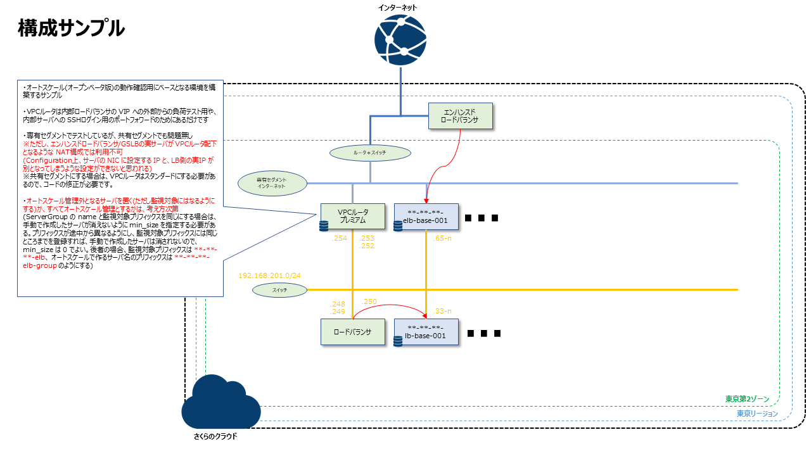

# Terraform でのさくらのクラウド環境構築サンプル

* 以下のような構成を作るサンプルです。  


* ご利用の環境でリポジトリをクローンしてください。

```
git clone https://github.com/shztki/sakura_sample
cd sakura_sample/
```

* 環境変数に最低限以下の設定が必要です。

```
SAKURACLOUD_ACCESS_TOKEN_SECRET=******************** → シークレットキー
SAKURACLOUD_ACCESS_TOKEN=*************************** → アクセスキー
TF_VAR_def_pass=************************************ → サーバに設定する rootパスワード
TF_VAR_office_cidr=**.**.**.**/**                    → サーバへの SSHアクセス等を許可する送信元
TF_VAR_my_domain=****.com                            → さくらのクラウドにゾーン追加しているドメイン(無ければ設定不要)
```

* ドメインの利用が無い場合は、 以下 2つのファイルは削除するか末尾に .disable を付けて無効化してください。
あわせて `variables.tf` 内の `variable "my_domain" {}` 行はコメントアウトしてください。

```
dns_data.tf
cert.tf
```

* 準備ができたら、Terraform を実行してリソースを作成ください。
なお、Makefile を用意しているので、以下コマンドサンプルの `terraform` 部分を `make` にしてもらってもだいじょうぶです。

```
terraform init
terraform plan
terraform apply
```

* ドメインの利用がある場合([sakuracloud_proxylb_acme](https://registry.terraform.io/providers/sacloud/sakuracloud/latest/docs/resources/proxylb_acme) を利用している場合)、エンハンスドロードバランサのルールのみ、なぜか作成されません(バグ？)。
再度 apply を実行すれば追加されるので、お手数ですが二度実行してください。

* SSH鍵ファイルは [ssh_key_gen](https://registry.terraform.io/providers/sacloud/sakuracloud/latest/docs/resources/ssh_key_gen) で生成されるようにしています。
`terrform apply` 実行後は以下のようにして、SSH鍵ファイルを作成ください。(`make apply` で実行した場合は不要です)

```
terraform output -raw ssh_private_key > ~/.ssh/sshkey
chmod 600 ~/.ssh/sshkey
```

* 手動で別途作成するオートスケール設定にて、ELB側は `192.168.201.64/27`、LB側は `192.168.201.32/27` を assign_cidr_block に設定し、max_size は 5 にする想定のため、ここで作成するサーバに付与するプライベートIP はその前の部分になるように計算式を入れたり、必要な数の SSH用のポートフォワード設定が自動で入るようにしています。
