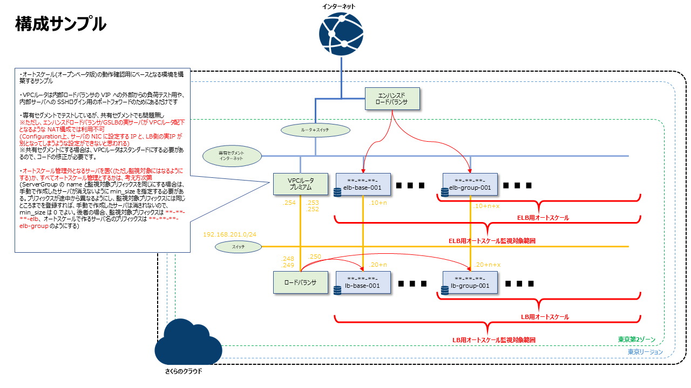

# Terraform でのさくらのクラウド環境構築サンプル

* 以下のような構成を作るサンプルです。  


* ご利用の環境でリポジトリをクローンしてください。

```
git clone https://github.com/shztki/sakura_sample
cd sakura_sample/autoscale
```

* 環境変数に最低限以下の設定が必要です。

```
SAKURACLOUD_ACCESS_TOKEN_SECRET=******************** → シークレットキー
SAKURACLOUD_ACCESS_TOKEN=*************************** → アクセスキー
TF_VAR_def_pass=************************************ → サーバに設定する rootパスワード
TF_VAR_office_cidr=**.**.**.**/**                    → サーバへの SSHアクセス等を許可する送信元
TF_VAR_my_domain=****.com                            → さくらのクラウドにゾーン追加しているドメイン(無ければ設定不要)
```

* ドメインの利用が無い場合は、 以下 2つのファイルは削除するか末尾に .disable を付けて無効化してください。
あわせて `variables.tf` 内の `variable "my_domain" {}` 行はコメントアウトしてください。

```
dns_data.tf
cert.tf
```

* 準備ができたら、Terraform を実行してリソースを作成ください。
なお、Makefile を用意しているので、以下コマンドサンプルの `terraform` 部分を `make` にしてもらってもだいじょうぶです。

```
terraform init
terraform plan
terraform apply
```

* ドメインの利用がある場合([sakuracloud_proxylb_acme](https://registry.terraform.io/providers/sacloud/sakuracloud/latest/docs/resources/proxylb_acme) を利用している場合)、エンハンスドロードバランサのルールのみ、なぜか作成されません(バグ？)。
再度 apply を実行すれば追加されるので、お手数ですが二度実行してください。

* SSH鍵ファイルは [ssh_key_gen](https://registry.terraform.io/providers/sacloud/sakuracloud/latest/docs/resources/ssh_key_gen) で生成されるようにしています。
`terrform apply` 実行後は以下のようにして、SSH鍵ファイルを作成ください。(`make apply` で実行した場合は不要です)

```
terraform output -raw ssh_private_key > ~/.ssh/sshkey
chmod 600 ~/.ssh/sshkey
```

* 手動で別途作成するオートスケール設定にて、ELB側は `192.168.201.64/27`、LB側は `192.168.201.32/27` を assign_cidr_block に設定し、max_size は 5 にする想定のため、ここで作成するサーバに付与するプライベートIP はその前の部分になるように計算式を入れたり、必要な数の SSH用のポートフォワード設定が自動で入るようにしています。

* 共有セグメントに変更したい場合は、変更箇所は以下です。

```
router.tf
→ ファイルは削除するか末尾に .disable を付けて無効化

variables.tf
→ vpc_router01 の plan を standard に変更

server.tf
→ 1つめの network_interface を upstream = "shared" に変更
→ disk_edit_parameter の ip_address はコメントアウト
→ disk_edit_parameter の gateway はコメントアウト
→ disk_edit_parameter の netmask はコメントアウト

vpc_router.tf
→ public_network_interface ブロックをすべてコメントアウト
```

# エンハンスドロードバランサでの水平オートスケールの設定サンプル

* 設定

```
監視対象が存在するゾーン : tk1b
監視対象のサーバ名のプリフィックス : shztki-dev-autoscale-elb
性能アップするCPU使用率 : 50%
性能ダウンするCPU使用率 : 20%
```

```yaml
resources:
  - type: ServerGroup
    name: "shztki-dev-autoscale-elb-group"
    zone: "tk1b"

    parent:
      type: ELB
      selector:
        names: ["shztki-dev-autoscale-elbtest001"]

    min_size: 0
    max_size: 5

    # スケール後のセットアップ猶予時間(省略時は0秒)
    setup_grace_period: 90

    shutdown_force: false

    template:
      # tags: [ "shztki", "dev", "autoscale-create" ]
      # description: "hscale-group"
      interface_driver: "virtio"
      plan:
        core: 1
        memory: 1
        dedicated_cpu: false

      network_interfaces:
        - upstream:
            names: ["shztki-dev-autoscale-router01"]
          packet_filter_id: 作成したリソースID
          assign_cidr_block: "**.**.**.56/29" #.57 から順に割り当てられる
          assign_netmask_len: 28
          default_route: "**.**.**.49"
          expose:
            ports: [80]
            server_group_name: "gr1"

        - upstream:
            names: ["shztki-dev-autoscale-192.168.201.0/24"]
          assign_cidr_block: "192.168.201.64/27" #.65から順に割り当てられる
          assign_netmask_len: 24

      disks:
        - os_type: "almalinux"
          plan: "ssd"
          connection: "virtio"
          size: 20

      edit_parameter:
        disabled: false # ディスクの修正を行わない場合はtrue
        host_name_prefix: "elb-group"
        password: "パスワード"
        disable_pw_auth: true
        enable_dhcp: false
        change_partition_uuid: true

        # SSH公開鍵の指定
        ssh_key_ids: ["作成したリソースID"]

        # スタートアップスクリプト
        # サーバのIPアドレス(共有セグメントの場合の自動割り当て)などを{{ .IPAddress}}のようなGoのテンプレートで利用可能
        startup_scripts:
          - |
            #!/bin/bash
            # @sacloud-once
            # eth1へのIPアドレス設定
            nmcli con mod "System eth1" \
            ipv4.method manual \
            ipv4.address {{ with index .NetworkInterfaces 1 }}{{ with .AssignedNetwork }}{{ .IpAddress }}/{{ .Netmask }}{{ end }}{{ end }} \
            connection.autoconnect "yes" \
            ipv6.method ignore
            # 反映
            nmcli con down "System eth1"; nmcli con up "System eth1"
            # NGINXのインストール
            yum install -y nginx
            systemctl enable nginx
            echo -e "keepalive_requests 10;\ngzip_proxied any;\ngzip on;\ngzip_http_version 1.0;\ngzip_comp_level 9;\ngzip_types text/html;" > /etc/nginx/conf.d/gzip.conf
            # 負荷をかけるためのテスト用コンテンツ。wikipediaのページをダウンロードして使います
            curl https://ja.wikipedia.org/wiki/%E4%B8%96%E7%95%8C%E9%81%BA%E7%94%A3 > /usr/share/nginx/html/sekai.html
            systemctl start nginx
            echo "server name: {{ .Name }}" >  /usr/share/nginx/html/index.html
            echo "OK" > /usr/share/nginx/html/live
            firewall-cmd --permanent --add-service http
            firewall-cmd --permanent --add-service ssh
            firewall-cmd --reload

# オートスケーラーの動作設定
autoscaler:
  cooldown: 300
```

# ロードバランサでの水平オートスケールの設定サンプル

* 設定

```
監視対象が存在するゾーン : tk1b
監視対象のサーバ名のプリフィックス : shztki-dev-autoscale-lb
性能アップするCPU使用率 : 50%
性能ダウンするCPU使用率 : 20%
```

```yaml
resources:
  - type: ServerGroup
    name: "shztki-dev-autoscale-lb-group"
    zone: "tk1b"

    parent:
      type: LoadBalancer
      selector: "shztki-dev-autoscale-lb"

    min_size: 0  # 最小インスタンス数
    max_size: 5  # 最大インスタンス数

    # スケール後のセットアップ猶予時間(省略時は0秒)
    setup_grace_period: 90

    template: # 各サーバのテンプレート
      plan:
        core: 1
        memory: 1

      # NICs
      network_interfaces:
        # eth0
        - upstream:
            names: ["shztki-dev-autoscale-192.168.201.0/24"]
          assign_cidr_block: "192.168.201.32/27" #.33 から順に割り当てられる
          assign_netmask_len: 24
          default_route: "192.168.201.254"
          expose:
            ports: [ 80 ] # このNICで上流リソースに公開するポート番号

            # LB向け
            vips: [ "192.168.201.250" ] 
            health_check:
              protocol: http
              path: "/"
              status_code: 200

      # ディスク
      disks:
        - os_type: "almalinux"
          plan: "ssd"
          connection: "virtio"
          size: 20

      # 1番目のディスクの対するパラメータ(対応しているアーカイブの場合のみ指定可能)
      edit_parameter:
        disabled: false # ディスクの修正を行わない場合はtrue
        host_name_prefix: "lb-group"
        password: "パスワード"
        disable_pw_auth: true
        enable_dhcp: false
        change_partition_uuid: true

        # SSH公開鍵の指定
        ssh_key_ids: ["作成したリソースID"]

        # スタートアップスクリプト
        # サーバのIPアドレス(共有セグメントの場合の自動割り当て)などを{{ .IPAddress}}のようなGoのテンプレートで利用可能
        startup_scripts:
          - |
            #!/bin/bash
            # @sacloud-once
            # ループバックインターフェースへのVIPアドレス設定
            nmcli connection add type dummy ifname vip01 ipv4.method manual ipv4.addresses 192.168.201.250/32 ipv6.method ignore
            # バーチャルサーバー宛のARPに応答しないようにする
            cat <<EOL >> /etc/sysctl.conf
            net.ipv4.conf.all.arp_ignore = 1
            net.ipv4.conf.all.arp_announce = 2
            EOL
            # 反映
            sysctl -p
            # NGINXのインストール
            yum install -y nginx
            systemctl enable nginx
            echo -e "keepalive_requests 10;\ngzip_proxied any;\ngzip on;\ngzip_http_version 1.0;\ngzip_comp_level 9;\ngzip_types text/html;" > /etc/nginx/conf.d/gzip.conf
            # 負荷をかけるためのテスト用コンテンツ。wikipediaのページをダウンロードして使います
            curl https://ja.wikipedia.org/wiki/%E4%B8%96%E7%95%8C%E9%81%BA%E7%94%A3 > /usr/share/nginx/html/sekai.html
            systemctl start nginx
            echo "server name: {{ .Name }}" >  /usr/share/nginx/html/index.html
            echo "OK" > /usr/share/nginx/html/live
            firewall-cmd --permanent --add-service http
            firewall-cmd --permanent --add-service ssh
            firewall-cmd --reload

# オートスケーラーの動作設定
autoscaler:
  cooldown: 300
```

## 注意事項
* 本サンプルを作成した 2022/5/30現在、さくらのクラウドのオートスケールは[「オープンベータ版」](https://manual.sakura.ad.jp/cloud/autoscale/autoscale.html)です。

* オートスケールに耐えうる構成とする場合、起動テンプレートとなるようなマスターイメージの管理や、ログ等の外部保存、ステートレスな設計など、システムの構成をしっかり考える必要があります。  
